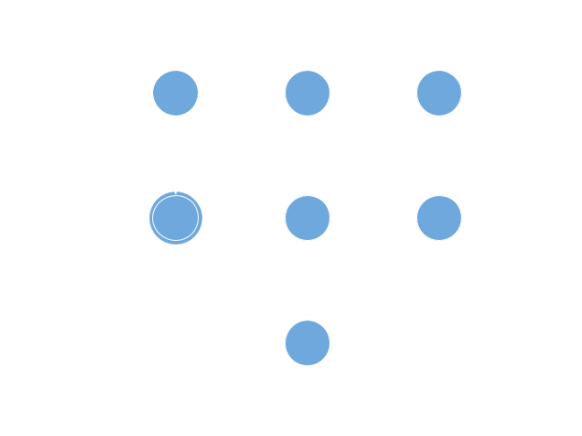

title: Theory of Computation Presentation
author:
  name: Lucas Burns
output: TuringPresentation.html
theme: sudodoki/reveal-cleaver-theme
controls: false

--

# Turing Machine Simulator
## a<sup>n</sup>b<sup>n</sup>c<sup>n</sup>

--

### How it works

* Written in java
* Creates two strings
  * Input string (TM Tape)
  * TM head string
* Executes based on TM head location


--

### State Diagram



-- 

### Code Sample

```
    public static void q3(String input, String pointer, int index)
    {
        // Reset condition
        if (input.charAt(index) == 'c' || input.charAt(index) == '_')
        {
            // Move pointer left + retrieve outputs
            String[] output = left(input, pointer, index);
            input = output[0];
            pointer = output[1];
            index = output[2].length();
            printState(input, pointer);

            q4(input, pointer, index);
        }
        else
        {
            qReject(input, index);
        }
    }
```

--

### And now a demonstration...