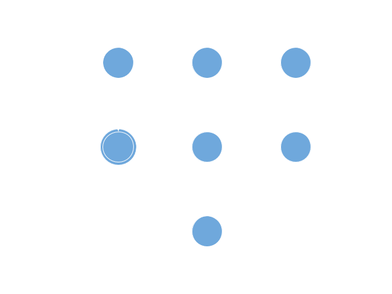

title: Theory of Computation Presentation
author:
  name: Lucas Burns
output: TuringPresentation.html
theme: sudodoki/reveal-cleaver-theme
controls: false

--

# Turing Machine Simulator
## anbncn

--

### How it works

* Written in java
* Creates two strings
  * Input string (TM Tape)
  * TM head string
* Executes based on TM head location

--

### State Diagram

-- 

### And now a demonstration...